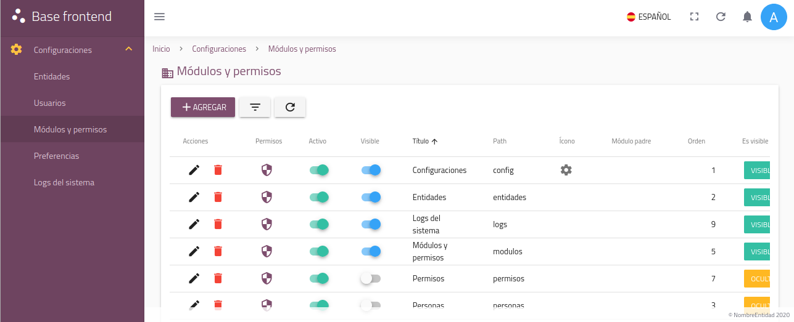
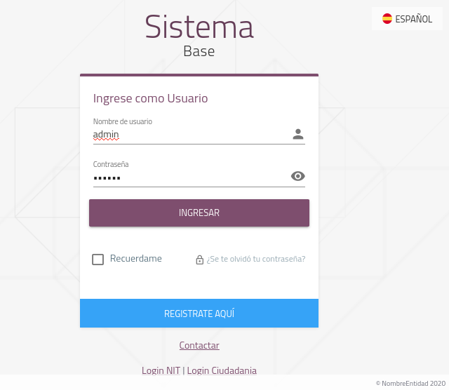

# SISTEMA DE DISEÑO BASE FRONTEND - Vue.js

> Base Frontend desarrollado con el framework Vue.js

## Técnologias empleadas
- Vue.js como Framework principal. [Sitio oficial](https://vuejs.org/) o en [español](https://es-vuejs.github.io/vuejs.org/)
- Vue-router para el manejo de rutas. [Documentación oficial](https://router.vuejs.org/)
- Vuex para el manejo de estados del sistema. [Documentación oficial](https://vuex.vuejs.org)
- Vuetify como framework CSS y componentes. [Sitio oficial](https://vuetifyjs.com/)
- Axios para el manejo de peticiones AJAX y demás. [Documentación](https://github.com/mzabriskie/axios)
- Vue-i18n para el manejo de mensajes para la internacionalización del sistema [Sitio oficial](https://kazupon.github.io/vue-i18n/en/)
- Sass como preprocesador CSS. [Documentación](http://sass-lang.com/)
- Webpack configurado para el uso de `Ecma Script 6` con babel y `vue-template` (.vue). [Documentación](http://vuejs-templates.github.io/webpack/)
- Semistandard como lint configurado para que se use con punto y coma(;) obligatorio. [Documentación](https://standardjs.com/)

## Características del sistema

## Estructura general
Para la creación de la estructura general del proyecto base se hizo uso de `vue-cli` con el template [Webpack](http://vuejs-templates.github.io/webpack/)

## Plugins
El proyecto cuenta con plugins(librerías que extienden la funcionalidad de `Vue.js`) para diversos usos y requerimientos:

Plugin | Descripción | Ejemplo |
--- | --- | --- |
$util | Plugin con funciones generales del sistema | `this.$util.toType([])` devuelve el tipo de dato más específico, en este caso devuelve `array` |
$bus | Plugin para compartir instancias entre instancias Vue o componentes, se recomienda usar `Vuex` para el intercambio de información de componentes | `this.$bus.$emmit('ejecuta-evento')` o `this.$bus.$on('define-evento', () => { ... })` |
$storage | Plugin wrapper de funciones para el manejo de `localstorage`, su uso es obligatorio | `this.$storage.get('mi-dato')` |
$filter | Plugin con funciones para el manejo de filtros para validaciones de datos | `<input @keydown="$filter.decimal($event)" />` o `this.$filter.empty(data)` verifica si la variable dato está vacia|
$datetime | Plugin con funciones para el manejo de fechas | `this.$datetime.toString('2017-08-17T23:59:14.357Z')` lo convierte a `17/08/2017` |
$message | Plugin con funciones de mensajes de notificaciones | `this.$message.success('¡Hola mundo!')` |
$alert | Plugin que reemplaza al `alert` nativo del navegador | `this.$alert('¡Hola mundo!')` |
$confirm | Plugin que reemplaza al `confirm` nativo del navegador | `this.$confirm('¿Desea continuar?', () => { ... esto se ejecuta cuando se acepte el mensaje ...})` |
$service | Plugin wrapper con funciones para el manejo de peticiones con `axios` su uso es obligatorio | `this.$service.post('usuarios', { ... datos ... }).then(response => { ... })` |

> Nota.- Se recomienda usar todos estos plugins y tratar de buscar la funcionalidad que se requiera dentro de estos para no sobrecargar el proyecto

## Componentes adicionales

Componente | Descripción | Documentación
--- | --- | --- |
FileUpload.vue | Para el manejo de subida de archivos, usa `vue-dropzone` | [FileUpload](/documentation/components/FileUpload.md)
SelectDate.vue | Selector de fecha de Día, Mes y Año | [SelectDate](/documentation/components/SelectDate.md)
CrudTable.vue | Contenedor para crear un datatable con su CRUD, la generación de CRUD **NO** es automático | [CrudTable](/documentation/components/CrudTable.md)
PdfView.vue | Visor de pdf |
Demofi.vue | Componente para el firmador Demofi |

## Vue Router
La configuración general de rutas se encuentra en `src/router/index.js`.

## Vuex
La configuración general de vuex para el manejo de estados se encuentra en `src/store/index` se recomienda manejarlo por módulos.

## Components
Se deben crear todos los componentes de la aplicación en `src/components/` y para los componentes generales en `src/common/util/`.

## Config
La configuración de las variables de entorno se encuentra en la carpeta `config/`, en el archivo `config/index.js` se configura el subdominio del sistema en la variable `assetsPublicPath`, se debe definir las variables globales en `config/dev.env.js` para desarrollo y `config/dev.env.js` para producción.

## i18n (Internacionalización)
Actualmente el sistema cuenta con internacionalización con [vue-i18n](https://kazupon.github.io/vue-i18n/en/) y se tiene definido tres idiomas: Aymara, Español e Inglés, los cuales se encuentran organizados en carpetas en el directorio `src/common/lang/`.

## Archivos estáticos
Los archivos estáticos(fuentes, imágenes, etc.) se encuentran en la carpeta `static/`, es bueno recordar que es distinto que la carpeta `src/assets` que está destinada a otro tipo de archivos y propósitos.

## Configuración de Tokens(variables del sistema de diseño)
Para cambiar los colores del sistema basado en tokens(variables) se debe cambiar en `src/assets/scss/_variables.scss` y en `src/main.js` en la constante `theme`.

## Importante
La elección de `Vuetify` fue debido a que esta ya tiene la mayoría de los componentes más comunes para la construcción de cualquier sistema, es importante usar todo lo que nos ofrece y no tratar de colocar librerías que ya tengan funcionalidades similares a las que ya se tienen, para no así sobrecargar el sistema.

## Instalación
Para instalar la aplicación se recomienda revisar el siguiente enlace:

> [INSTALL.md](INSTALL.md)

## Sobre el proyecto
  - Licencia: [LPG-Bolivia v1.0](LICENCIA.md)
